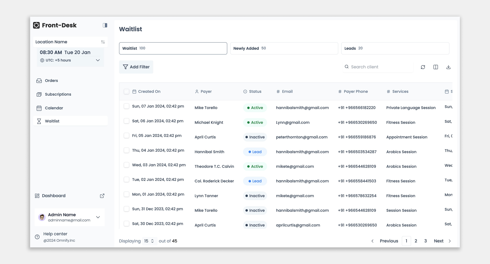

# Dashboard Project

This project is a responsive dashboard built using React.js and Tailwind CSS. It is a purely frontend project that provides a user-friendly interface for managing various tasks and data.

## Features

- **Responsive Design**: Built with Tailwind CSS for a responsive and adaptive user interface.
- **User-Friendly Interface**: Intuitive design for easy navigation and management of tasks and data.

## Technologies Used

- **React.js**: A JavaScript library for building user interfaces.
- **Tailwind CSS**: A utility-first CSS framework for rapid UI development.

## Hosted Website

You can view the live project [here](https://shiiivani.github.io/omnify/).
